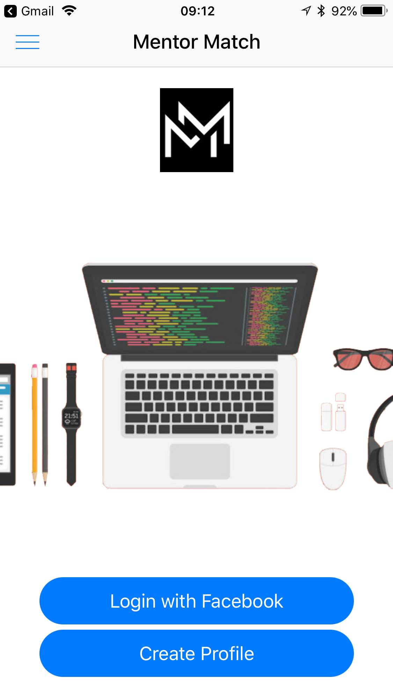
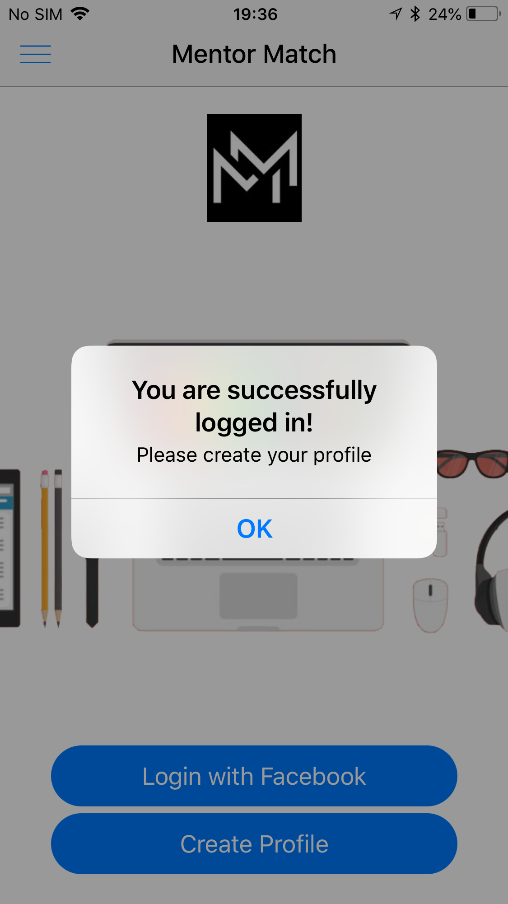
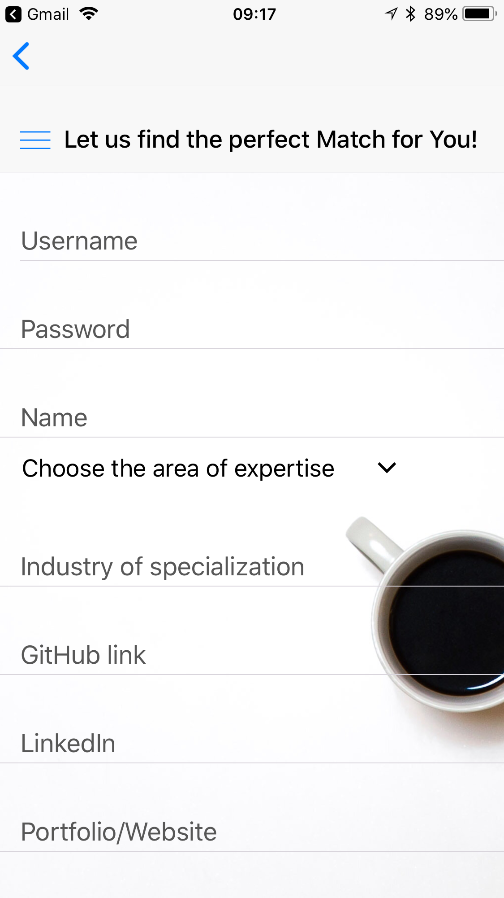
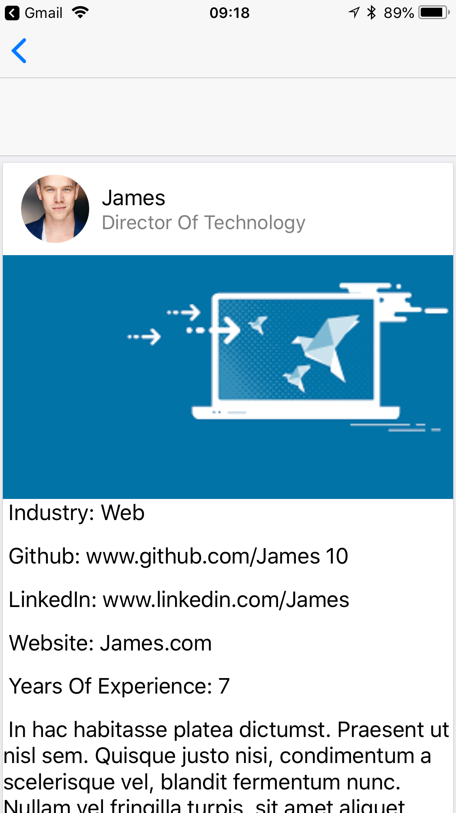

  

# Mentor Match

Mentor Match is a mobile application for both professionals seeking mentorship and those looking to pay their expertise forward.
<p align="left">
 <a href="https://badge.fury.io/js/react-native"></a>
 <a href="https://badge.fury.io/js/native-base"></a>
 <a href="https://badge.fury.io/js/expo"></a>
 <a href="https://badge.fury.io/js/sequelize"></a>
</p>
<br>
<br>
<br>
<p align="left">

  
  
  
  

</p>


## Table of Contents


* [How It Works](#how-it-works)
* [Technologies](#Technologies)
* [Instructions](#Instructions)
  * [react native](#react-native)
  * [server](#express-node-server)
  * [expo](#expo)
  * [mysql](#mysql)


## How It Works

  User's sign up and create a profile with current skills and work experience, and based their profile, Mentor Match will return other users that fit the Mentor / Mentee match and open a chat for users to interact. Still in testing, .....something about the functionality of the app. and how each mentor / mentee is matched....

## Technologies

  * JavaScript    
  * Node.js    
  * React-Native   
  * Native-Base       
  * Sequelize    
  * Express    
  * Expo   
  * MySql

## Instructions
  In order to run Mentor Match locally you will need the following installed:

  [Node](https://nodejs.org/en/)

  [MySql (windows)](https://dev.mysql.com/downloads/workbench/)
  
  [MySql (Mac)](https://www.sequelpro.com/)
  
  [Expo](https://expo.io/)
  
  After you have installed those: 

  `git clone https://github.com/elliechen321/Mentor_Matching_App.git` 

  This application runs on two seperate ports, so it is important to install dependencies in both the front end and back end. 

#### `react-native`

  From bash / terminal run the following:

  `cd Mentor_Matching_App`  or cd into whatever directory you cloned the git repo into.

  `npm install`  to run for react-native dependencies.


#### Expo `expo`

Expo is a toolchain built for react-native development. In order to run Mentor Match, your phone and computer will need to be on the same network.
Checkout the [docs] if you encounter any problems. (https://expo.io/learn)

`npm install exp --global`


#### Express-Node-Server `express-node-server`

`cd MentorBackend`

open `config/config.json`

Enter your mysql password into the development object.

```
 {git 
  "development": {
    "username": "root",
    "password": "<YOUR PASSWORD HERE>", 
    "database": "mentor_crud_db",
    "host": "127.0.0.1",
    "dialect": "mysql"
  },
``` 
Run the following commands to get install dependencies for the back end.

`npm install`

Initialize a local database / run migration and seed files.

`sequelize db:create mentor_crud_db`

`sequelize db:migrate`

`sequelize db:seed:all`

Start the express server.

`node server.js`

